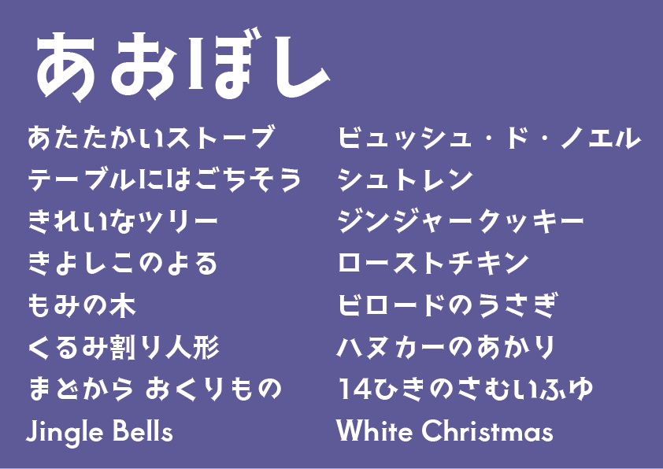

# Aoboshi

<h2>このフォントについて</h2>
「あおぼし」はCopperplate Gothicのような 
文字の太さが均一でセリフのある和文書体を目指して制作しました。 

<h2>収録文字</h2>

・半角英数、約物、ラテン文字など 
・ひらがな、カタカナ、全角記号 
・漢字 150文字〜 

<h2>その他</h2>

フォントファイルの販売・複製・再配布を禁じます。 
 
何かありましたら下記までご連絡ください。 
matsuba723@gmail.com 
twitter@723moji 
